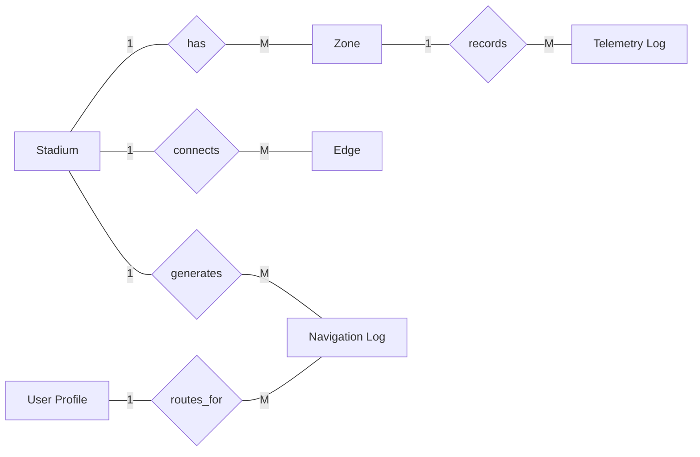

# Access Navigator AI – E-R Diagram (Pictorial Form)

Below is a pictorial E-R diagram in rectangle + diamond style (similar to notebook ER format).

## Entity Labels

- **Stadium**: `id, name, location, city, country, capacity, latitude, longitude, created_at`
- **Zone**: `id, stadium_id, name, zone_type, status, crowd_density_pct, density_trend, accessibility_score, elevation_m, capacity, coord_x, coord_y, updated_at`
- **Edge**: `id, stadium_id, source_zone_id, target_zone_id, weight_minutes, distance_meters, is_wheelchair_accessible, has_elevator, has_ramp, step_count`
- **Telemetry Log**: `id, stadium_id, zone_id, crowd_density_pct, detected_people_count, anomaly_detected, status, recorded_at`
- **User Profile**: `id, wheelchair_user, visually_impaired, hearing_impaired, max_stairs_allowed, preferred_language, created_at`
- **Navigation Log**: `id, stadium_id, start_zone, end_zone, need, recommended_path, eta_minutes, confidence, cot_reasoning, user_rating, user_feedback, created_at`
