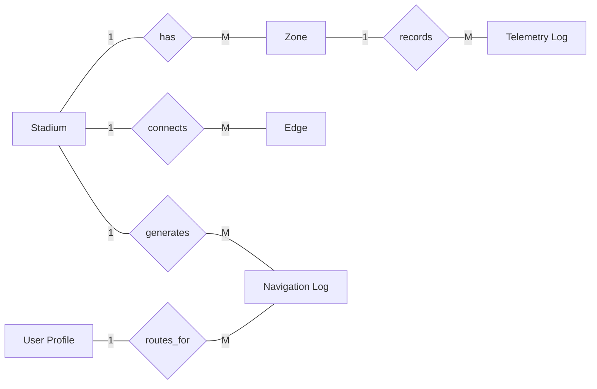

# Access Navigator AI – E-R Diagram (Pictorial Form)

Below is a pictorial E-R diagram in rectangle + diamond style (similar to notebook ER format).

## Entity Labels

- **Stadium**: `id, name, location, city, country, capacity, latitude, longitude, created_at`
- **Zone**: `id, stadium_id, name, zone_type, status, crowd_density_pct, density_trend, accessibility_score, elevation_m, capacity, coord_x, coord_y, updated_at`
- **Edge**: `id, stadium_id, source_zone_id, target_zone_id, weight_minutes, distance_meters, is_wheelchair_accessible, has_elevator, has_ramp, step_count`
- **Telemetry Log**: `id, stadium_id, zone_id, crowd_density_pct, detected_people_count, anomaly_detected, status, recorded_at`
- **User Profile**: `id, wheelchair_user, visually_impaired, hearing_impaired, max_stairs_allowed, preferred_language, created_at`
- **Navigation Log**: `id, stadium_id, start_zone, end_zone, need, recommended_path, eta_minutes, confidence, cot_reasoning, user_rating, user_feedback, created_at`

## Simple Explanation (Teacher-Friendly)

Is ER diagram me hum dekh rahe hain ki app stadium ke andar navigation ka data kaise manage karti hai.

- **Stadium** main entity hai. Ek stadium ke andar multiple **Zones** hote hain.
- **Zone** stadium ke alag-alag areas ko represent karta hai (jaise Gate, Food Court, Exit).
- **Edge** batata hai ki kaun sa zone kis zone se connected hai, aur waha tak jaane me kitna time/distance lagega.
- **Telemetry Log** har zone ka live status store karta hai (crowd kitna hai, koi anomaly hai ya nahi).
- **User Profile** user ki accessibility needs store karta hai (wheelchair, vision issue, etc.).
- **Navigation Log** store karta hai ki user ne kaunsi route request ki aur system ne kya route suggest kiya.

### Relationships ko simple me samjho

1. **1 Stadium -> Many Zones**  
   Ek stadium me bahut saare zones ho sakte hain.
2. **1 Stadium -> Many Edges**  
   Stadium ke zones ke beech multiple connections (paths) hote hain.
3. **1 Zone -> Many Telemetry Logs**  
   Har zone ka status time-time par log hota rehta hai.
4. **1 Stadium -> Many Navigation Logs**  
   Stadium ke users ki multiple route requests save hoti hain.
5. **1 User Profile -> Many Navigation Logs**  
   Ek user alag-alag time par kai navigation requests kar sakta hai.

Short me: **Stadium structure + live crowd data + user needs** ko combine karke system safe aur accessible route suggest karta hai.
